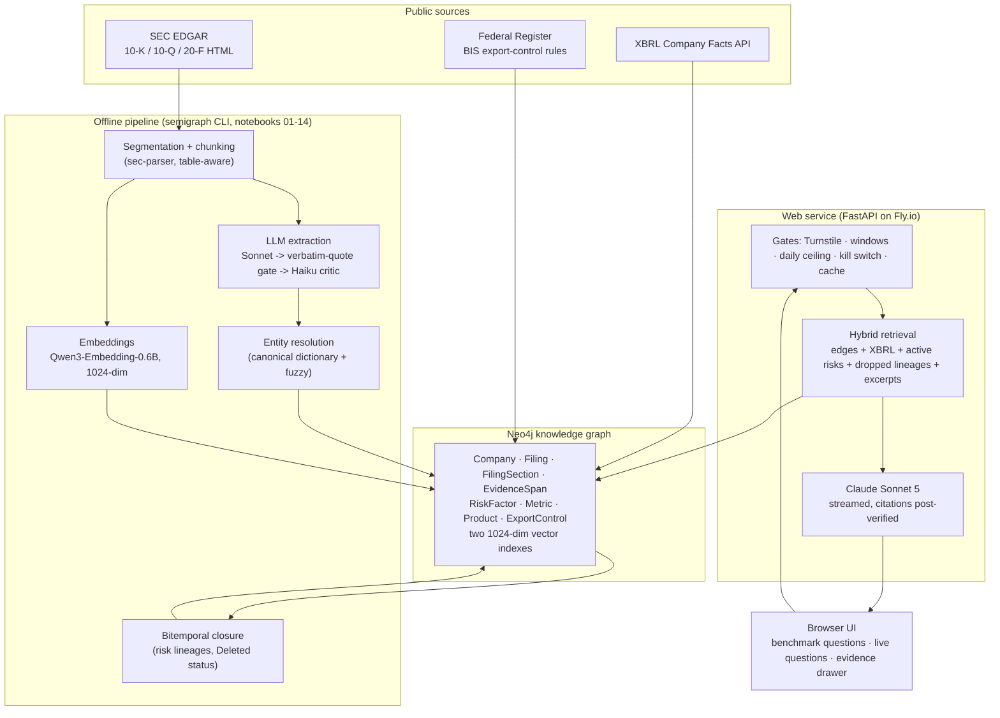
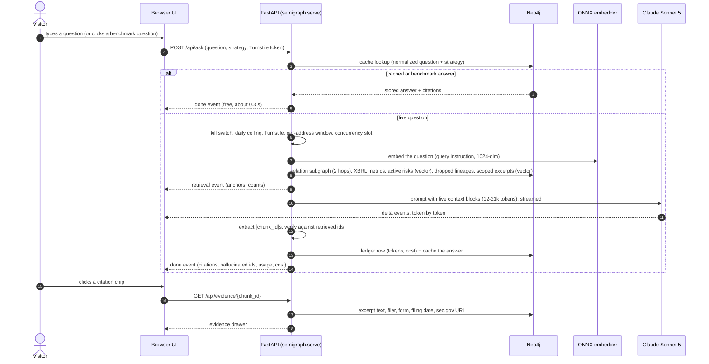
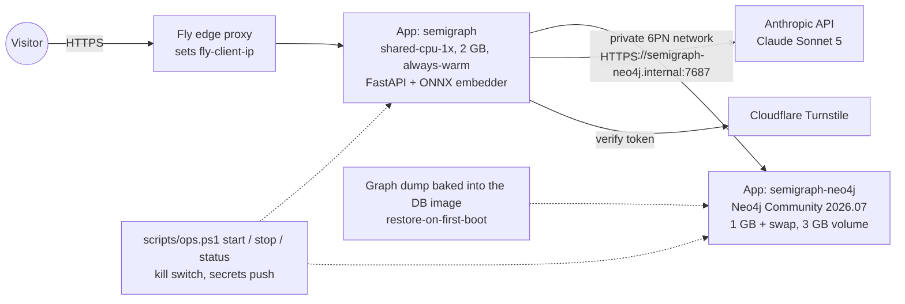

# semigraph — AI Semiconductor Risk Intelligence (GraphRAG)

[](https://github.com/amit-badave-04/ai-semiconductor-risk-intelligence-graphrag/actions/workflows/tests.yml)

A production-deployed **GraphRAG** system over SEC filings and US export-control rules for the AI
semiconductor supply chain. It ingests 10-K / 10-Q / 20-F filings and XBRL facts for 14 keystone
companies (Nvidia, AMD, Intel, Broadcom, Qualcomm, TSMC, ASML, Micron, Samsung, Apple, Microsoft,
Amazon, Alphabet, Meta) plus BIS / Federal Register export-control announcements, builds a
**bitemporal Neo4j knowledge graph with full provenance** — every relationship is backed by a
verbatim filing excerpt — and answers multi-hop supply-chain and export-control questions with
citations that are verified before they are shown.

**🔗 Live demo:** https://semigraph.fly.dev/ — click any of the 20 benchmark questions (free, cached)
or ask your own (one streamed Claude Sonnet 5 call, bot-gated and capped per day). Every citation
chip opens the SEC excerpt it points to. The owner parks the demo when it is not in use; if the page
does not load, it is offline (see [Operations](#operations-start--stop)).

> Data is public SEC EDGAR and Federal Register material. This is a research/portfolio system, not
> investment advice.

---

## What it does

- **Multi-hop dependency tracing** — Meta's AI capex plans → accelerator vendors → TSMC → HBM
  suppliers → the export-control regime, every hop cited to a filing excerpt.
- **Export-control exposure screening** — which companies are `AFFECTED_BY` which BIS rules, with
  the disclosure that proves it.
- **Risk evolution over time** — risks newly introduced or **dropped** between annual reports; the
  bitemporal layer records when a risk was first seen and when it stopped being disclosed.
- **Deterministic financial lookups** — revenue, capex, R&D per fiscal period straight from XBRL
  facts; numbers are never parsed out of prose by a model.
- **Audit-grade cited Q&A** — every factual sentence carries a `[chunk_id]`; the service verifies
  each cited id against the retrieved context and reports any that were not there (0 across the
  benchmark), and the system declines when the corpus lacks the facts.
- **A reproducible evaluation harness** — a 20-question gold benchmark, mechanical checks first,
  LLM judges second, a failure taxonomy, and a second judge family to check judge bias.

## Why a graph, not vector RAG

Supply-chain and export-control questions are **relationship and time questions**: who depends on
whom, since when, under which rule, and did that risk survive into the latest annual report. Plain
vector retrieval over filing text fails at exactly this. In the benchmark it scored **0 % on
temporal questions** (it presents a withdrawn 2023 risk as current) and it cannot follow chains that
are never stated in one passage. `semigraph` answers from a graph in which relationships, risk
lineages and XBRL metrics are first-class, and uses vector search only to pick supporting excerpts.

## Results

**M6 gold benchmark** — 20 questions (numeric, dependency, regulatory, temporal, risk, refusal),
Claude Sonnet 5 answering and judging ([`artifacts/eval_report.json`](artifacts/eval_report.json)):

| metric | hybrid GraphRAG | vector-only baseline |
|---|---|---|
| correctness | **100 %** | 80 % |
| faithfulness (claims supported by context) | 0.865 | 0.943 (inflated by hedging and refusals) |
| citation validity (cited ids ∈ retrieved context) | **100 %** | 100 % |
| temporal questions | **100 %** | **0 %** — the bitemporal layer is the entire difference |
| numeric questions | **100 %** | 80 % (XBRL metrics vs prose) |
| context precision (relevant share of retrieved chunks) | 0.275 | 0.325 |

**Cross-judge re-scoring** — the same 40 answers re-judged by a *different model family* (Claude
Haiku 4.5) on 2026-09-09, with the new context-recall metric
([`artifacts/eval_report.haiku.json`](artifacts/eval_report.haiku.json)):

| metric (Haiku judge) | hybrid | vector |
|---|---|---|
| correctness | 90 % | 85 % |
| faithfulness | 0.927 | 0.919 |
| **context recall** (facts the grading notes require that were actually retrieved) | **0.870** | 0.644 |
| temporal correctness | 0.67 | 0.33 |
| temporal context recall | 0.61 | 0.33 |

Read honestly: the second judge narrows the hybrid lead (it disagreed with Sonnet on two hybrid
answers and agreed with one more vector answer), the ranking holds, and the new recall metric shows
*where* the remaining gap is — temporal questions, where even hybrid retrieval surfaces only about
60 % of the required facts. Judge re-scoring is not fully deterministic: two runs of the same
command differed by up to 0.02 on faithfulness and by one labelled failure.

**Failure taxonomy** ([`artifacts/error_analysis.json`](artifacts/error_analysis.json)) — 11 failing
runs (correctness, faithfulness < 0.8, or an invalid citation), 36 % labelled mechanically from the
scores, the rest by one Haiku call each:

| system | labels |
|---|---|
| vector | 3 × REFUSAL_OVERTRIGGER (declined although the answer was retrievable), 2 × RETRIEVAL_MISS |
| hybrid | 2 × STALE_RISK_LEAK (a dropped risk presented as current), 2 × UNGROUNDED_CLAIM, 1 × RETRIEVAL_MISS, 1 × NUMERIC_MISMATCH (judge label; the evidence text describes a truncated sentence, so treat this one as noisy) |

The two `STALE_RISK_LEAK` cases are the most actionable finding: the answerer receives the dropped
lineages as a separate block yet sometimes narrates them as current. That is a prompt fix, and it is
on the roadmap below with the paid re-benchmark it requires.

## Stack choice and why

| Layer | Choice | Reasoning |
|---|---|---|
| Graph database | **Neo4j Community 2026.07**, self-hosted on Fly.io with a volume (local development: Neo4j Desktop) | The retrieval code needs native vector indexes and the Cypher 25 `SEARCH` clause; Community supports both. AuraDB Free would be $0 but pauses after 72 h idle and needs an account created by hand; self-hosting is a one-line `NEO4J_URI` swap away and costs ≈ $0.60/month when stopped. |
| LLM | **Claude Sonnet 5** via LiteLLM for extraction, answering and the primary judges; **Claude Haiku 4.5** as extraction critic, relevance/recall judge, and second-opinion judge | The benchmark numbers belong to Sonnet 5; the product caps cost instead of downgrading the model. Haiku gives an independent judge family cheaply. |
| Query embeddings | `Qwen/Qwen3-Embedding-0.6B` — sentence-transformers in the pipeline, an **8-bit weight-only ONNX** build in the service (no torch) | Open-source, 1024-dim, 32k context. The quantized build scores cosine 0.998 min / 0.999 mean against the original on the benchmark questions ([`artifacts/onnx_embedder_fidelity.json`](artifacts/onnx_embedder_fidelity.json)); the community int8 / q4 exports were rejected at 0.87 / 0.94. |
| SEC ingestion | `edgartools`, `sec-parser`, the XBRL Company Facts API | Section-aware parsing with fallbacks for custom layouts (Intel has no item headings; ASML files 20-F). Financial numbers are XBRL-only. |
| Extraction | Sonnet extractor → verbatim-quote gate → Haiku critic, checkpointed per chunk | A relationship only enters the graph if its evidence quote is found verbatim in the chunk. |
| Web service | **FastAPI + Server-Sent Events** on Fly.io (always-warm while online, 2 GB) | Answers stream token by token. The machine stays warm while the demo is online (a cold start costs ~10 s and made every first visit slow); cost is controlled by the STOP script, not by idle auto-stop. |
| Bot and abuse control | **Cloudflare Turnstile** (fail-closed), per-address windows, daily ceiling, kill switch | Every live question is a paid model call. |
| Packaging and tests | `uv`, Python 3.13, the `semigraph` wheel with a typer CLI, **162 pytest tests with the LLM mocked** (zero spend) | Every battle scar from the notebooks is pinned by a test. |

## The graph is the integrity boundary

- **Provenance on every edge.** `SUPPLIES_TO`, `DEPENDS_ON`, `CUSTOMER_OF`, `COMPETES_WITH` and
  `AFFECTED_BY` relationships carry the chunk ids of the excerpts that state them; every `RiskFactor`
  has a `HAS_EVIDENCE` edge with the quoted sentence.
- **Bitemporal risk lineages.** Risk factors are clustered into lineages across annual reports;
  each carries `first_seen` / `last_seen`, and a lineage absent from the latest 10-K is closed with
  `status: Deleted`. The retriever exposes dropped lineages as their own context block, which is why
  hybrid scores on temporal questions and vector-only does not.
- **Numbers come from XBRL only.** 731 `Metric` nodes (revenue, capex, R&D, …) per fiscal period;
  the answer prompt is told which block is deterministic.
- **Citations are post-verified.** The service extracts every `[chunk_id]` from the answer and
  compares it with the ids that were actually retrieved; the UI shows the count of any that were not.
- **Refusals are graded.** Two benchmark questions have no answer in the corpus (Samsung does not
  file with the SEC); the system must decline, and it does.

Graph as deployed: 26 companies (14 keystones + 12 ecosystem entities), 59 filings, 151 sections,
2,492 evidence spans, 8,082 risk factors in 495 closed lineages, 731 XBRL metrics, 1,024 products,
13 BIS export-control rules, 22,792 relationships.

## Architecture



### How a question is answered



### Deployment



The database is never exposed publicly; the API reaches it over Fly's private network only.

## Evaluation harness

Three layers, in the order of the [Agentic_Evals](https://github.com/abhineer/Agentic_Evals)
methodology, adapted to a stateless GraphRAG (no tool, planning or memory loop to evaluate):

1. **Mechanical checks first.** Numeric answers within ±0.5 % of the XBRL value, required
   substrings, refusal detection, and citation validity against the retrieved ids. No judge gets
   the final word where a rule can decide.
2. **LLM judges only where needed.** Faithfulness (the judge sees the *full* context the answerer
   saw — judging against excerpts alone was a real metric bug found in M6), correctness against
   grading notes, context precision per chunk and **context recall** against the grading notes
   (both on Haiku).
3. **Error analysis loop.** Every failing run gets one of nine failure labels — mechanically when
   the scores already say why, by one Haiku call otherwise — so the output is a fix list, not a score.
   A `--judge-model` switch re-scores the checkpointed answers with another model family to measure
   judge self-preference without re-answering.

```bash
uv run semigraph eval                                   # answers + judges (paid, checkpointed, resumable)
uv run semigraph eval --rescore --judge-model anthropic/claude-haiku-4-5 --report-suffix .haiku --analyze
```

Details, applicability matrix and what is deliberately not implemented: [docs/EVALUATION.md](docs/EVALUATION.md).

## Production hardening and cost controls

Every live question is a paid model call, so the service is built around bounded spend:

| Control | Where it lives | Default |
|---|---|---|
| Bot gate | Cloudflare Turnstile, **fail-closed** (`TURNSTILE_REQUIRED=true`): no valid token, no live question | on |
| Per-address windows | in-process sliding windows keyed by the Fly edge header only (spoofed forwarding headers are ignored) | 5 live / 30 cached per 10 min, 120 reads per min |
| Daily ceiling | `SvcQuery` ledger in Neo4j — survives restarts and auto-stops | 150 live answers/day (≈ $9 worst case) |
| Kill switch | `SvcPolicy` in Neo4j via an admin endpoint; cached answers keep working | off |
| Answer cache | `SvcAnswer` in Neo4j, 24 h; the 20 benchmark answers are seeded permanently | on |
| Spend accounting | provider-reported tokens per answer, logged on success **and** on mid-stream failure | on |
| Output budget | streamed answers cannot regenerate on truncation; truncated answers are never cached | 2,400 tokens |
| Transport | HSTS, CSP, no-sniff, deny-frame; database on the private network only; secrets via `flyctl secrets` from a git-ignored `.env.fly` | on |

An independent review of the service diff found three real defects before launch (a spoofable
client-IP header, ledger writes before any gate, spend lost on mid-stream failure); all were fixed
and are covered by tests. Decisions with their measurements: [adr/0001-production-stack.md](adr/0001-production-stack.md).

Measured on the live deployment: a live hybrid answer streams in 15–20 s and costs $0.035–0.056
(12–21k prompt tokens); cached answers return in 0.2–0.3 s. The API machine stays warm while online
(a cold start would cost about 10 s). Both machines online ≈ $17/month; parked ≈ $0.75/month.

## Operations (START / STOP)

```powershell
.\scripts\ops.ps1 start    # DB machine up -> deploy API -> kill switch off -> URL
.\scripts\ops.ps1 stop     # kill switch on -> API scaled to 0 -> DB machine stopped
.\scripts\ops.ps1 status   # both apps, /healthz, kill switch, spend ledger
```

Order matters: START brings the database up before the API and re-enables live questions last;
STOP silences live questions first, then removes the API machine, then stops the database (its
volume and data persist). Secrets are pushed with `scripts/push_fly_secrets.py` (values on stdin,
names only printed), the kill switch with `scripts/kill_switch.py on|off|status`. Full runbook,
first-time setup, graph updates and troubleshooting: [docs/RUNBOOK.md](docs/RUNBOOK.md).

## Reproduce it

Prerequisites: Python 3.13 + [uv](https://docs.astral.sh/uv/), Neo4j Desktop (local development),
an Anthropic API key; for deployment a Fly.io account with `flyctl` and a Cloudflare Turnstile widget.

```bash
git clone https://github.com/amit-badave-04/ai-semiconductor-risk-intelligence-graphrag && cd ai-semiconductor-risk-intelligence-graphrag
uv sync --extra serve                    # .venv with the SDK, pipeline and web-service deps
copy .env.example .env                   # Anthropic key, Neo4j password, SEC user-agent
uv run pytest -q                         # 162 tests, LLM mocked, zero spend

# pipeline (Neo4j Desktop started)
uv run semigraph ingest                  # EDGAR + XBRL + Federal Register -> parse -> chunk (no LLM cost)
uv run semigraph build-graph --extract   # PAID extraction (prints an estimate and asks first), then loads the graph
uv run semigraph query "Which export-control rules affect Nvidia?"

# web service locally (torch-free embedder built once, ~1.1 GB, fidelity-checked)
uv run python scripts/build_onnx_embedder.py
$env:EMBEDDING_BACKEND="onnx"; $env:ONNX_MODEL_PATH="models\qwen3-embedding-0.6b-q8\model_q8.onnx"
uv run uvicorn semigraph.serve.main:app --app-dir src --port 8080

# deployment (first time; afterwards .\scripts\ops.ps1 start)
flyctl apps create semigraph-neo4j; flyctl volumes create neo4j_data -a semigraph-neo4j -r sin -s 3
python -m scripts.push_fly_secrets --app semigraph-neo4j --stage; cd deploy\neo4j; flyctl deploy --ha=false; cd ..\..
flyctl apps create semigraph; python -m scripts.push_fly_secrets --stage; flyctl deploy --ha=false
```

The graph shipped to Fly is the exact benchmarked graph, exported from Neo4j Desktop in
Community-compatible format and baked into the database image
([deploy/neo4j/seed/README.md](deploy/neo4j/seed/README.md)). Package documentation (install,
configuration, API, CLI, module map, design rules): [src/semigraph/README.md](src/semigraph/README.md).

## Known limits (deliberate)

- **Corpus scope.** 14 keystone companies, 59 filings (latest annual reports plus the risk-factor
  history and latest quarterlies). Samsung does not file with the SEC and is an entity-only node;
  ASML's 2023/2024 20-Fs could not be sectioned by the parser and are skipped by design.
- **Context precision is low (~0.3).** Retrieval always returns eight excerpts even when the graph
  blocks already answer; a reranker with adaptive k is the planned fix.
- **Temporal recall is ~0.6.** The bitemporal layer wins the temporal questions, but the retriever
  still surfaces only part of the required facts; the stale-risk-leak failures follow from that.
- **Judges are LLMs.** Sonnet judging Sonnet inflates agreement; the Haiku re-scoring is the check,
  and it disagrees on 2 of 20 hybrid answers. Judge runs vary slightly between invocations.
- **A single machine per app, no HA.** Per-address windows are process-local by design; the daily
  ceiling and kill switch are in the database so they survive restarts.
- **Aborted requests still bill.** If a visitor closes the tab mid-answer, the model call completes
  and counts against the ceiling.
- **The prompt is locked** to the benchmarked version; any prompt change requires a paid
  re-benchmark before merge.

## Lifecycle and milestones

Notebook-first: every stage was proven in a numbered Jupyter notebook, then refactored into the
`semigraph` SDK; notebooks 00–14 are the frozen experimental record.

| Phase | Milestone | Notebooks | Deliverable |
|---|---|---|---|
| Environment and scaffold | M0 | `00_smoke_test` | env + Neo4j + LLM + embeddings verified |
| Data acquisition (Nvidia) | M1 | `01_edgar_acquisition`, `02_xbrl_facts` | raw filings + XBRL facts |
| Parsing and chunking | M2 | `03_semantic_parsing`, `04_chunking` | section-aware chunk store |
| Knowledge graph | M3 | `05` … `09` | Nvidia graph with provenance |
| Retrieval and answering | M4 | `10_retrieval_strategies`, `11_answer_generation` | cited Q&A |
| Scale + temporal | M5 | `12_full_universe_ingestion`, `13_temporal_versioning` | 14-company bitemporal graph |
| Evaluation | M6 | `14_evaluation` | the benchmark above |
| SDK packaging | M7 | `15_sdk_inference_driver` | `semigraph` wheel + CLI + tests |
| Productionization | P0–P6 | — | live service, Fly deployment, ops, eval extensions ([plan](docs/PRODUCTIONIZATION_PLAN.md)) |

Feasibility research (two studies, verdict BUILD): [docs/](docs/).

## Repo map

```
src/semigraph/        the SDK: config · llm · embeddings (local | onnx | remote) · ingestion · parsing ·
                      extraction · graph · retrieval (hybrid retriever, streaming answerer) · eval ·
                      serve (FastAPI: routes, guard, store, static UI) · artifacts (schema, prompts,
                      benchmark, examples)
scripts/              ops.ps1 (START/STOP/status) · kill_switch.py · push_fly_secrets.py ·
                      build_onnx_embedder.py
deploy/               neo4j/ (Community image + restore-on-boot seed, fly.toml) · requirements-serve.*
Dockerfile, fly.toml  the API image (model stage + runtime stage) and its Fly config
tests/                162 pytest tests, LLM mocked (pipeline logic, retrieval, answerer, service gates,
                      SSE framing, eval scoring, error analysis)
artifacts/            schema.cypher · canonical_entities.json · benchmark.json · eval reports (Sonnet
                      and Haiku judges) · error_analysis.json · onnx_embedder_fidelity.json
docs/                 RUNBOOK · EVALUATION · PRODUCTIONIZATION_PLAN · PROJECT_STATUS · SETUP_GUIDE ·
                      feasibility studies
adr/                  0001-production-stack.md
notebooks/            00-14 frozen record · 15 SDK inference driver
data/                 git-ignored data lake (raw, interim, processed) — rebuildable from public APIs
```

## Roadmap

1. **Stale-risk-leak prompt fix** — the failure taxonomy's most actionable finding; needs a paid
   re-benchmark before merge (≈ $3).
2. **Reranker + adaptive k** — targets context precision (~0.3) and temporal recall (~0.6).
3. **BM25 / full-text channel** merged with the vector channel by reciprocal rank fusion.
4. **Synthetic benchmark growth (20 → ~50)** over a {question type × filer × metric × year} grid,
   every expected value verified programmatically against the graph before admission.
5. **Shrink the ONNX embedder** (fp16 token-embedding table → ~750 MB, a 1 GB machine).
