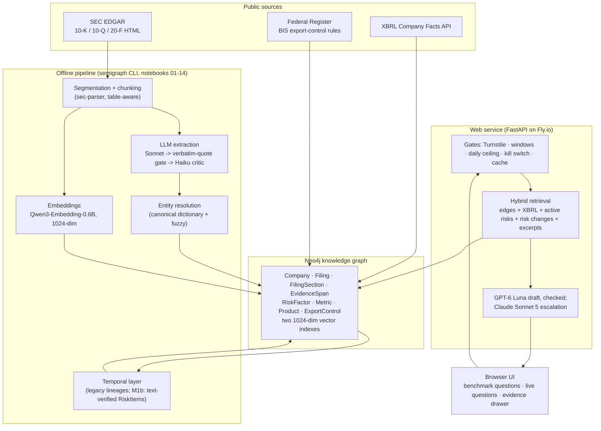
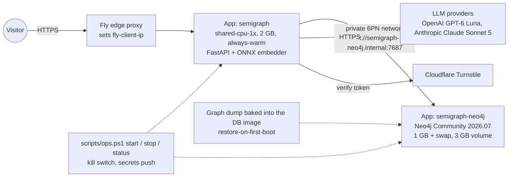

# semigraph — AI Semiconductor Risk Intelligence (GraphRAG)

[](https://github.com/amit-badave-04/ai-semiconductor-risk-intelligence-graphrag/actions/workflows/tests.yml)

A production-deployed **GraphRAG** system over SEC filings and US export-control rules for the AI
semiconductor supply chain. It ingests 10-K / 10-Q / 20-F filings and XBRL facts for 14 keystone
companies (Nvidia, AMD, Intel, Broadcom, Qualcomm, TSMC, ASML, Micron, Samsung, Apple, Microsoft,
Amazon, Alphabet, Meta) plus BIS / Federal Register export-control announcements, builds a
**bitemporal Neo4j knowledge graph with provenance** — company relationships and risk disclosures
are backed by verbatim filing excerpts, while the links from companies to export-control rules are
keyword matches to *external* Federal Register rules, not statements the company made — and answers
multi-hop supply-chain and export-control questions with citations that are checked against the
retrieved context before the answer is released.

**🔗 Live demo:** https://semigraph.fly.dev/ — click any of the 20 benchmark questions (free, cached)
or ask your own (a GPT-6 Luna draft that must pass automatic checks, escalated to Claude Sonnet 5 when a
check fails or the question is about change over time; bot-gated and capped per day). Every citation
chip opens the SEC excerpt, XBRL fact or Federal Register rule it points to. The owner parks the demo when
it is not in use; if the page does not load, it is offline (see [Operations](#operations-start--stop)).

> **Status (2026-09-26): v2 is a work in progress, and the temporal layer is being rebuilt.** An independent
> review found that the "risks dropped from the latest annual report" answers contained false drops, and that
> the benchmark used to score them could not see that. Milestone M1b replaces the drop layer with a text-grounded
> comparison of individual risk items and re-measures accuracy with a source-text-grounded instrument.
> Read [docs/v2/REVIEW_2026-09-26.md](docs/v2/REVIEW_2026-09-26.md) (what was wrong and why) and
> [docs/v2/M1B_PLAN.md](docs/v2/M1B_PLAN.md) (the fix). Accuracy figures from the earlier instrument are kept below
> as history only.

> Data is public SEC EDGAR and Federal Register material. This is a research/portfolio system, not
> investment advice.

---

## What it does

- **Multi-hop dependency tracing** — Meta's AI capex plans → accelerator vendors → TSMC → HBM
  suppliers → the export-control regime, every hop cited to a filing excerpt.
- **Export-control exposure screening** — which companies are `AFFECTED_BY` which BIS rules, with
  the disclosure that proves it.
- **Risk evolution over time (being rebuilt in M1b)** — risks newly introduced, **removed** or reworded
  between annual reports. The layer deployed today clusters LLM-extracted summaries and can report a risk as
  dropped while it is still in the newer filing word for word; M1b compares individual risk items and checks
  every candidate removal against the newer filing's full text before it is reported.
- **Deterministic financial lookups** — revenue, capex, R&D per fiscal period straight from XBRL
  facts; numbers are never parsed out of prose by a model, and each figure in an answer is checked
  against the retrieved context.
- **Cited Q&A** — every factual sentence should carry a citation (a filing passage, an XBRL fact
  `xbrl:...` or a Federal Register rule `fr:...`); the service checks that each cited id was
  retrieved and that numbers match the retrieved context, shows unmatched numbers and bracketed
  pseudo-citations as warnings, and declines when the corpus lacks the facts. These checks do not
  prove that a sentence is supported by the passage it cites.
- **A reproducible evaluation harness** — a 20-question gold benchmark, mechanical checks first,
  LLM judges second, a failure taxonomy, and a second judge family to check judge bias. Its
  instrument is being replaced by a source-text-grounded one (see the status note above).

## Why a graph, not vector RAG

Supply-chain and export-control questions are **relationship and time questions**: who depends on
whom, since when, under which rule, and did that risk survive into the latest annual report. Plain
vector retrieval over filing text is weak at exactly this: it cannot follow chains that are never
stated in one passage and has no notion of two filings' difference. `semigraph` answers from a graph in
which relationships, risk items and XBRL metrics are first-class, and uses vector search only to pick
supporting excerpts. The earlier benchmark scored vector-only 0 % on temporal questions, but it graded
against notes that assumed the drop layer was right, so that figure is **withdrawn** until the benchmark is
re-measured. The vector-only strategy remains selectable on the page as a comparison baseline without temporal
reasoning.

## Results

> **Historical, withdrawn as current claims.** Every table in this section was produced by an evaluation
> instrument that could not detect false "dropped risk" claims or numeric errors on temporal questions (its
> judge was calibrated by AI labellers who saw the same retrieved context as the model, not the filing; the
> two example answers the review found wrong were rated correct unanimously). The benchmark is being
> **re-measured with a source-text-grounded instrument** in M1b; new numbers will be added from a committed
> artifact only. Details: [docs/v2/REVIEW_2026-09-26.md](docs/v2/REVIEW_2026-09-26.md) sections 1-2 and
> [docs/v2/M1B_PLAN.md](docs/v2/M1B_PLAN.md) section E. Mechanical checks (numeric values, citation ids,
> refusals) are unaffected; the correctness and temporal figures are the ones in question.

**M6 gold benchmark (v1, historical)** — 20 questions (numeric, dependency, regulatory, temporal, risk,
refusal), Claude Sonnet 5 answering and judging ([`artifacts/eval_report.json`](artifacts/eval_report.json)):

| metric | hybrid GraphRAG | vector-only baseline |
|---|---|---|
| correctness (judge) | 20 / 20 | 16 / 20 |
| faithfulness (claims supported by context) | 0.865 | 0.943 (inflated by hedging and refusals) |
| citation validity (cited ids ∈ retrieved context; mechanical) | 100 % | 100 % |
| temporal questions (graded against notes that assumed the drop layer was right) | 3 / 3 | 0 / 3 |
| numeric questions | 5 / 5 | 4 / 5 (XBRL metrics vs prose) |
| context precision (relevant share of retrieved chunks) | 0.275 | 0.325 |

**v1.1 re-measurement (2026-09-26, historical)** — the same 20 questions on the graph rebuilt from data
through 2026-09-25 (snapshot `snap-20260924-7feaaf9bfe`: 74 filings, 166 BIS rules), Sonnet 5 answering and
judging ([`artifacts/eval_report.v2-baseline.json`](artifacts/eval_report.v2-baseline.json)), same
instrument and same caveat; the table above is v1's original measurement:

| metric | hybrid GraphRAG | vector-only baseline |
|---|---|---|
| correctness (judge) | 19 / 20 (13 / 13 mechanical) | 15 / 20 |
| faithfulness | 0.892 | 0.903 |
| citation validity (mechanical) | 100 % | 95 % |
| context precision / recall | 0.275 / 0.745 | 0.325 / 0.657 |
| answer cost (list price, provider-reported tokens) | $0.037 | $0.023 |

Read honestly: the "correctness" and "temporal" rows above are the ones the review invalidated. The single hybrid
miss (TSMC supply-chain risks) was a *judge-unstable* item, and the "three blind labellers" behind
[`artifacts/judge_labels.json`](artifacts/judge_labels.json) were AI passes that saw only the retrieved context,
so they could not check a claim against the filing (the M1b plan marks those labels superseded and relabels
from the source text). The vector numeric drop is the freshness model working as designed: a superseded annual
report's MD&A is no longer retrievable by default, and vector-only has no XBRL metric block to fall back on.

**Cross-judge re-scoring (historical)** — the same 40 answers re-judged by a *different model family* (Claude
Haiku 4.5) on 2026-09-09, with the new context-recall metric
([`artifacts/eval_report.haiku.json`](artifacts/eval_report.haiku.json)):

| metric (Haiku judge) | hybrid | vector |
|---|---|---|
| correctness | 90 % | 85 % |
| faithfulness | 0.927 | 0.919 |
| **context recall** (facts the grading notes require that were actually retrieved) | **0.870** | 0.644 |
| temporal correctness | 0.67 | 0.33 |
| temporal context recall | 0.61 | 0.33 |

Read honestly: the second judge narrows the hybrid lead (it disagreed with Sonnet on two hybrid
answers and agreed with one more vector answer), the ranking holds, and the new recall metric shows
*where* the remaining gap is — temporal questions, where even hybrid retrieval surfaces only about
60 % of the required facts. Judge re-scoring is not fully deterministic: two runs of the same
command differed by up to 0.02 on faithfulness and by one labelled failure.

**Failure taxonomy** ([`artifacts/error_analysis.json`](artifacts/error_analysis.json)) — 11 failing
runs (correctness, faithfulness < 0.8, or an invalid citation), 36 % labelled mechanically from the
scores, the rest by one Haiku call each:

| system | labels |
|---|---|
| vector | 3 × REFUSAL_OVERTRIGGER (declined although the answer was retrievable), 2 × RETRIEVAL_MISS |
| hybrid | 2 × STALE_RISK_LEAK (a dropped risk presented as current), 2 × UNGROUNDED_CLAIM, 1 × RETRIEVAL_MISS, 1 × NUMERIC_MISMATCH (judge label; the evidence text describes a truncated sentence, so treat this one as noisy) |

The two `STALE_RISK_LEAK` cases were read at the time as a prompt problem (the answerer receives the
dropped lineages as a separate block yet sometimes narrates them as current). The review found the deeper
cause: many of those "dropped" lineages were still in the newer filing, so the block itself was wrong
(section 1 of [the review](docs/v2/REVIEW_2026-09-26.md)); M1b fixes the block first.

## Stack choice and why

| Layer | Choice | Reasoning |
|---|---|---|
| Graph database | **Neo4j Community 2026.07**, self-hosted on Fly.io with a volume (local development: Neo4j Desktop) | The retrieval code needs native vector indexes and the Cypher 25 `SEARCH` clause; Community supports both. AuraDB Free would be $0 but pauses after 72 h idle and needs an account created by hand; self-hosting is a one-line `NEO4J_URI` swap away and costs ≈ $0.60/month when stopped. |
| LLM | **Answering (v1.2): GPT-6 Luna by default (`ANSWER_MODEL`), Claude Sonnet 5 (`ESCALATION_MODEL`) for questions about change over time and for any draft the answer checks reject**, via LiteLLM; **Claude Sonnet 5** (`LLM_MODEL`) extracts and judges, **Claude Haiku 4.5** is the extraction critic and relevance/recall judge | A seven-model bake-off on identical retrieved contexts ([docs/v2/BAKEOFF.md](docs/v2/BAKEOFF.md)) found Luna close to Sonnet on every question type except multi-year risk evolution, at $0.0013 instead of $0.037 per answer as judged by the earlier instrument, which the M1b plan replaces; the deployed path costs $0.0067 per answer on the benchmark (a judgement call, not a gate pass: see the write-up). The production models are set in `fly.toml`; changing them back is two settings ([docs/RUNBOOK.md](docs/RUNBOOK.md#answering-models-v12)). |
| Query embeddings | `Qwen/Qwen3-Embedding-0.6B` — sentence-transformers in the pipeline, an **8-bit weight-only ONNX** build in the service (no torch) | Open-source, 1024-dim, 32k context. The quantized build scores cosine 0.998 min / 0.999 mean against the original on the benchmark questions ([`artifacts/onnx_embedder_fidelity.json`](artifacts/onnx_embedder_fidelity.json)); the community int8 / q4 exports were rejected at 0.87 / 0.94. |
| SEC ingestion | `edgartools`, `sec-parser`, the XBRL Company Facts API | Section-aware parsing with fallbacks for custom layouts (Intel has no item headings; ASML files 20-F). Financial numbers are XBRL-only. |
| Extraction | Sonnet extractor → verbatim-quote gate → Haiku critic, checkpointed per chunk | A relationship only enters the graph if its evidence quote is found verbatim in the chunk. |
| Web service | **FastAPI + Server-Sent Events** on Fly.io (always-warm while online, 2 GB) | Answers stream token by token. The machine stays warm while the demo is online (a cold start costs ~10 s and made every first visit slow); cost is controlled by the STOP script, not by idle auto-stop. |
| Bot and abuse control | **Cloudflare Turnstile** (fail-closed), per-address windows, daily ceiling, kill switch | Every live question is a paid model call. |
| Packaging and tests | `uv`, Python 3.13, the `semigraph` wheel with a typer CLI, **over 1,000 pytest tests with the LLM mocked** (zero spend) | Every battle scar from the notebooks is pinned by a test. |

## The graph is the integrity boundary

- **Provenance on every edge.** `SUPPLIES_TO`, `DEPENDS_ON`, `CUSTOMER_OF`, `COMPETES_WITH` and
  `AFFECTED_BY` relationships carry the chunk ids of the excerpts that state them; every `RiskFactor`
  has a `HAS_EVIDENCE` edge with the quoted sentence.
- **Risk lineages (legacy, being replaced in M1b).** Risk factors are clustered into lineages across
  annual reports; each carries `first_seen` / `last_seen`, and a lineage absent from the latest 10-K is
  closed with `status: Deleted`. The clustering never checks the newer filing's text, and the review found
  it reporting risks as dropped that are still there word for word, so the deployed "dropped" list is not
  trustworthy. M1b adds `RiskItem` nodes (one per risk subcaption) whose removal is decided from the newer
  filing's full text, with the decision (`removed_in`, `SUCCEEDED_BY {kind, decided_by}`) stored on the graph.
- **Export-control links are external and keyword-based.** `AFFECTED_BY` edges join a company to a Federal
  Register rule by keyword matching; they say nothing about what the company disclosed. The prompt and the UI
  label them as external events and cite them as `[fr:<document number>]`.
- **Numbers come from XBRL only.** `Metric` nodes (revenue, capex, R&D, …) per fiscal period (739 in the
  current graph); the answer prompt is told which block is deterministic, and a check confirms that each
  number in an answer matches the retrieved context.
- **Citations are post-checked.** The service extracts every citation (`[chunk id]`, `[xbrl:...]`,
  `[fr:...]`) from the answer and compares it with the ids that were actually retrieved; the UI shows any
  that were not, plus numbers that match nothing in the context and bracketed text that is not a citation.
  This proves the id was retrieved, not that the sentence is supported by that passage.
- **Refusals are graded.** Two benchmark questions have no answer in the corpus (Samsung does not
  file with the SEC); the system must decline, and it does.

Graph as deployed (snapshot `snap-20260924-7feaaf9bfe`, from the v1.2 rebuild): 74 filings, 3,152 evidence
spans, 9,775 risk factors, 739 XBRL metrics, 166 BIS export-control rules (26 flagged relevant) and 94
`AFFECTED_BY` edges. The M1b rebuild adds the `RiskItem` layer and a new snapshot id.

## Architecture


```mermaid
flowchart TB
    subgraph Sources["Public sources"]
        EDGAR["SEC EDGAR<br/>10-K / 10-Q / 20-F HTML"]
        XBRL["XBRL Company Facts API"]
        FR["Federal Register<br/>BIS export-control rules"]
    end

    subgraph Pipeline["Offline pipeline (semigraph CLI, notebooks 01-14)"]
        PARSE["Segmentation + chunking<br/>(sec-parser, table-aware)"]
        EXTRACT["LLM extraction<br/>Sonnet -> verbatim-quote gate -> Haiku critic"]
        RESOLVE["Entity resolution<br/>(canonical dictionary + fuzzy)"]
        EMBED["Embeddings<br/>Qwen3-Embedding-0.6B, 1024-dim"]
        TEMPORAL["Temporal layer<br/>(legacy lineages; M1b: text-verified RiskItems)"]
    end

    subgraph Graph["Neo4j knowledge graph"]
        G["Company · Filing · FilingSection · EvidenceSpan<br/>RiskFactor · Metric · Product · ExportControl<br/>two 1024-dim vector indexes"]
    end

    subgraph Service["Web service (FastAPI on Fly.io)"]
        GUARD["Gates: Turnstile · windows · daily ceiling · kill switch · cache"]
        RET["Hybrid retrieval<br/>edges + XBRL + active risks + risk changes + excerpts"]
        LLM["GPT-6 Luna draft, checked;<br/>Claude Sonnet 5 escalation"]
    end

    UI["Browser UI<br/>benchmark questions · live questions · evidence drawer"]

    EDGAR --> PARSE
    XBRL --> G
    FR --> G
    PARSE --> EXTRACT --> RESOLVE --> G
    PARSE --> EMBED --> G
    G --> TEMPORAL --> G
    UI --> GUARD --> RET --> G
    RET --> LLM --> UI
```

### How a question is answered

```mermaid
sequenceDiagram
    autonumber
    actor V as Visitor
    participant UI as Browser UI
    participant API as FastAPI (semigraph.serve)
    participant DB as Neo4j
    participant ONNX as ONNX embedder
    participant LLM as GPT-6 Luna (draft) / Claude Sonnet 5 (escalation)

    V->>UI: types a question (or clicks a benchmark question)
    UI->>API: POST /api/ask (question, strategy, Turnstile token)
    API->>DB: cache lookup (normalized question + strategy)
    alt cached or benchmark answer
        DB-->>API: stored answer + citations
        API-->>UI: done event (free, about 0.3 s)
    else live question
        API->>API: kill switch, daily ceiling, Turnstile, per-address window, concurrency slot
        API->>ONNX: embed the question (query instruction, 1024-dim)
        API->>DB: relation subgraph (2 hops), XBRL metrics, active risks (vector), risk changes (legacy lineages; M1b: text-verified items), scoped excerpts (vector)
        API-->>UI: retrieval event (anchors, counts)
        API->>LLM: prompt with five context blocks (12-21k tokens), streamed
        LLM-->>UI: delta events, token by token
        API->>API: extract citation ids, check them and the numbers against the retrieved context
        API->>DB: ledger row (tokens, cost) + cache the answer
        API-->>UI: done event (citations, hallucinated ids, usage, cost)
    end
    V->>UI: clicks a citation chip
    UI->>API: GET /api/evidence/{chunk_id}
    API->>DB: excerpt text, filer, form, filing date, sec.gov URL
    API-->>UI: evidence drawer
```

### Deployment


```mermaid
flowchart LR
    Visitor((Visitor)) -->|HTTPS| Edge["Fly edge proxy<br/>sets fly-client-ip"]
    Edge --> API["App: semigraph<br/>shared-cpu-1x, 2 GB, always-warm<br/>FastAPI + ONNX embedder"]
    API -->|"private 6PN network<br/>bolt://semigraph-neo4j.internal:7687"| NEO["App: semigraph-neo4j<br/>Neo4j Community 2026.07<br/>1 GB + swap, 3 GB volume"]
    API -->|HTTPS| Claude["LLM providers<br/>OpenAI GPT-6 Luna, Anthropic Claude Sonnet 5"]
    API -->|verify token| TS["Cloudflare Turnstile"]
    Seed["Graph dump baked into the DB image<br/>restore-on-first-boot"] -.-> NEO
    Ops["scripts/ops.ps1 start / stop / status<br/>kill switch, secrets push"] -.-> API
    Ops -.-> NEO
```

The database is never exposed publicly; the API reaches it over Fly's private network only.

## Evaluation harness

Three layers, in the order of the [Agentic_Evals](https://github.com/abhineer/Agentic_Evals)
methodology, adapted to a stateless GraphRAG (no tool, planning or memory loop to evaluate):

1. **Mechanical checks first.** Numeric answers within ±0.5 % of the XBRL value, required
   substrings, refusal detection, and citation validity against the retrieved ids. No judge gets
   the final word where a rule can decide.
2. **LLM judges only where needed.** Faithfulness (the judge sees the *full* context the answerer
   saw — judging against excerpts alone was a real metric bug found in M6), correctness against
   grading notes, context precision per chunk and **context recall** against the grading notes
   (both on Haiku).
3. **Error analysis loop.** Every failing run gets one of nine failure labels — mechanically when
   the scores already say why, by one Haiku call otherwise — so the output is a fix list, not a score.
   A `--judge-model` switch re-scores the checkpointed answers with another model family to measure
   judge self-preference without re-answering.

```bash
uv run semigraph eval                                   # answers + judges (paid, checkpointed, resumable)
uv run semigraph eval --rescore --judge-model anthropic/claude-haiku-4-5 --report-suffix .haiku --analyze
```

Details, applicability matrix and what is deliberately not implemented: [docs/EVALUATION.md](docs/EVALUATION.md).

## Production hardening and cost controls

Every live question is a paid model call, so the service is built around bounded spend:

| Control | Where it lives | Default |
|---|---|---|
| Bot gate | Cloudflare Turnstile, **fail-closed** (`TURNSTILE_REQUIRED=true`): no valid token, no live question | on |
| Per-address windows | in-process sliding windows keyed by the Fly edge header only (spoofed forwarding headers are ignored) | 5 live / 30 cached per 10 min, 120 reads per min |
| Daily ceiling | `SvcQuery` ledger in Neo4j — survives restarts and auto-stops | 150 live answers/day (≈ $9 worst case at Sonnet-only prices) |
| Kill switch | `SvcPolicy` in Neo4j via an admin endpoint; cached answers keep working | off |
| Answer cache | `SvcAnswer` in Neo4j, 24 h; the 20 benchmark answers are seeded permanently | on |
| Spend accounting | provider-reported tokens per answer, logged on success **and** on mid-stream failure | on |
| Output budget | streamed answers cannot regenerate on truncation; truncated answers are never cached | 2,400 tokens |
| Transport | HSTS, CSP, no-sniff, deny-frame; database on the private network only; secrets via `flyctl secrets` from a git-ignored `.env.fly` | on |

An independent review of the service diff found three real defects before launch (a spoofable
client-IP header, ledger writes before any gate, spend lost on mid-stream failure); all were fixed
and are covered by tests. Decisions with their measurements: [adr/0001-production-stack.md](adr/0001-production-stack.md).

Measured on v1 (Sonnet-only): a live hybrid answer streams in 15–20 s and costs $0.035–0.056
(12–21k prompt tokens); cached answers return in 0.2–0.3 s. Measured on the v1.2 answering path (benchmark,
local): about $0.0067 per answer on average and 6 s, because a cheap draft is checked before it is shown (the
first token appears after generation, not during it). The API machine stays warm while online
(a cold start would cost about 10 s). Both machines online ≈ $17/month; parked ≈ $0.75/month.

**Answering models — which setting does what.** The production models are pinned in `fly.toml [env]`, so a
fresh deploy reproduces them; the code defaults keep a local run on Sonnet.

| Setting | Role | Code default | Production (`fly.toml`) |
|---|---|---|---|
| `ANSWER_MODEL` | drafts every live answer | `anthropic/claude-sonnet-5` | `openai/gpt-6-luna` |
| `ESCALATION_MODEL` | re-answers a draft the checks reject; answers change-over-time questions directly | empty (no escalation) | `anthropic/claude-sonnet-5` |
| `LLM_MODEL` | extraction and evaluation judges only | `anthropic/claude-sonnet-5` | not used by the service |

**Revert to Sonnet only:** set `ANSWER_MODEL = "anthropic/claude-sonnet-5"` and `ESCALATION_MODEL = ""` in
`fly.toml` and run `flyctl deploy` (with an empty escalation model, or the same model in both roles, Sonnet
streams every answer live and nothing is buffered). Provider keys (`OPENAI_API_KEY`, `ANTHROPIC_API_KEY`) are
Fly secrets. Steps and checks: [docs/RUNBOOK.md](docs/RUNBOOK.md#answering-models-v12).

## Operations (START / STOP)

```powershell
.\scripts\ops.ps1 start    # DB machine up -> deploy API -> kill switch off -> URL
.\scripts\ops.ps1 stop     # kill switch on -> API scaled to 0 -> DB machine stopped
.\scripts\ops.ps1 status   # both apps, /healthz, kill switch, spend ledger
```

Order matters: START brings the database up before the API and re-enables live questions last;
STOP silences live questions first, then removes the API machine, then stops the database (its
volume and data persist). Secrets are pushed with `scripts/push_fly_secrets.py` (values on stdin,
names only printed), the kill switch with `scripts/kill_switch.py on|off|status`. Full runbook,
first-time setup, graph updates and troubleshooting: [docs/RUNBOOK.md](docs/RUNBOOK.md).

## Reproduce it

Prerequisites: Python 3.13 + [uv](https://docs.astral.sh/uv/), Neo4j Desktop (local development),
an Anthropic API key; for deployment a Fly.io account with `flyctl` and a Cloudflare Turnstile widget.

```bash
git clone https://github.com/amit-badave-04/ai-semiconductor-risk-intelligence-graphrag && cd ai-semiconductor-risk-intelligence-graphrag
uv sync --extra serve                    # .venv with the SDK, pipeline and web-service deps
copy .env.example .env                   # Anthropic key, Neo4j password, SEC user-agent
uv run pytest -q                         # over 1,000 tests, LLM mocked, zero spend

# pipeline (Neo4j Community 2026.07 or Desktop started; NEO4J_URI / NEO4J_PASSWORD / NEO4J_DATABASE in .env)
uv run semigraph ingest --as-of 2026-09-25     # EDGAR + XBRL + ALL BIS rules -> parse -> chunk (append-only ids; no LLM cost)
uv run semigraph freshness --as-of 2026-09-25  # what EDGAR / the Federal Register have that the lake lacks (0 = up to date)
uv run semigraph extract --dry-run             # estimate only; then `extract --max-usd 6` (PAID, checkpointed, resumable)
uv run semigraph risk-items --coverage         # free: detect risk items per annual filing; LOW / SUSPECT filings are 'not compared'
uv run semigraph risk-items                    # write data/interim/risk_items/*.parquet (+ per-filing quality sidecars)
uv run semigraph align-items --dry-run         # free: what changed between consecutive annual filings (text-verified); --adjudicate is optional and ~$0.01
uv run semigraph align-items                   # write data/interim/risk_alignment/*.parquet
uv run semigraph build-graph --rebuild --yes   # versioned FULL rebuild (refuses while chunks are unextracted or alignment is stale)
PYTHONPATH=src python scripts/verify_graph.py  # freshness + item-layer invariants, read-only
uv run semigraph query "Which export-control rules affect Nvidia?"
# new data snapshot -> new benchmark log (the default eval_runs.jsonl holds v1's runs and would only be resumed):
uv run semigraph eval --runs-file eval_runs.mysnapshot.jsonl --report-suffix .mysnapshot --max-answer-usd 1.75

# web service locally (torch-free embedder built once, ~1.1 GB, fidelity-checked)
uv run python scripts/build_onnx_embedder.py
$env:EMBEDDING_BACKEND="onnx"; $env:ONNX_MODEL_PATH="models\qwen3-embedding-0.6b-q8\model_q8.onnx"
uv run uvicorn semigraph.serve.main:app --app-dir src --port 8080

# deployment (first time; afterwards .\scripts\ops.ps1 start)
flyctl apps create semigraph-neo4j; flyctl volumes create neo4j_data -a semigraph-neo4j -r sin -s 3
python -m scripts.push_fly_secrets --app semigraph-neo4j --stage; cd deploy\neo4j; flyctl deploy --ha=false; cd ..\..
flyctl apps create semigraph; python -m scripts.push_fly_secrets --stage; flyctl deploy --ha=false
```

The graph shipped to Fly is the exact benchmarked graph, exported from Neo4j Desktop in
Community-compatible format and baked into the database image
([deploy/neo4j/seed/README.md](deploy/neo4j/seed/README.md)). Package documentation (install,
configuration, API, CLI, module map, design rules): [src/semigraph/README.md](src/semigraph/README.md).

## Known limits (deliberate)

- **Corpus scope.** 14 keystone companies, 74 filings (latest annual reports plus the risk-factor
  history and latest quarterlies). Samsung does not file with the SEC and is an entity-only node;
  ASML's 2023/2024 20-Fs could not be sectioned by the parser and are skipped by design.
- **Context precision is low (~0.3).** Retrieval always returns eight excerpts even when the graph
  blocks already answer; a reranker with adaptive k is the planned fix.
- **Temporal recall is ~0.6.** The bitemporal layer wins the temporal questions, but the retriever
  still surfaces only part of the required facts; the stale-risk-leak failures follow from that.
- **Judges are LLMs.** Sonnet judging Sonnet inflates agreement; the Haiku re-scoring is the check,
  and it disagrees on 2 of 20 hybrid answers. Judge runs vary slightly between invocations.
- **A single machine per app, no HA.** Per-address windows are process-local by design; the daily
  ceiling and kill switch are in the database so they survive restarts.
- **Aborted requests still bill.** If a visitor closes the tab mid-answer, the model call completes
  and counts against the ceiling.
- **Prompt changes need a re-benchmark.** The M1b prompt changes (external-event labelling, `xbrl:` / `fr:`
  citations) are merged on `v2` but their accuracy effect is unmeasured until the source-text-grounded
  benchmark exists; do not quote an accuracy number for them.

## Lifecycle and milestones

Notebook-first: every stage was proven in a numbered Jupyter notebook, then refactored into the
`semigraph` SDK; notebooks 00–14 are the frozen experimental record.

| Phase | Milestone | Notebooks | Deliverable |
|---|---|---|---|
| Environment and scaffold | M0 | `00_smoke_test` | env + Neo4j + LLM + embeddings verified |
| Data acquisition (Nvidia) | M1 | `01_edgar_acquisition`, `02_xbrl_facts` | raw filings + XBRL facts |
| Parsing and chunking | M2 | `03_semantic_parsing`, `04_chunking` | section-aware chunk store |
| Knowledge graph | M3 | `05` … `09` | Nvidia graph with provenance |
| Retrieval and answering | M4 | `10_retrieval_strategies`, `11_answer_generation` | cited Q&A |
| Scale + temporal | M5 | `12_full_universe_ingestion`, `13_temporal_versioning` | 14-company bitemporal graph |
| Evaluation | M6 | `14_evaluation` | the benchmark above |
| SDK packaging | M7 | `15_sdk_inference_driver` | `semigraph` wheel + CLI + tests |
| Productionization | P0–P6 | — | live service, Fly deployment, ops, eval extensions ([plan](docs/PRODUCTIONIZATION_PLAN.md)) |

Feasibility research (two studies, verdict BUILD): [docs/](docs/).

## Repo map

```
src/semigraph/        the SDK: config · llm · embeddings (local | onnx | remote) · ingestion · parsing ·
                      extraction · graph · retrieval (hybrid retriever, streaming answerer) · eval ·
                      serve (FastAPI: routes, guard, store, static UI) · artifacts (schema, prompts,
                      benchmark, examples)
scripts/              ops.ps1 (START/STOP/status) · kill_switch.py · push_fly_secrets.py ·
                      build_onnx_embedder.py
deploy/               neo4j/ (Community image + restore-on-boot seed, fly.toml) · requirements-serve.*
Dockerfile, fly.toml  the API image (model stage + runtime stage) and its Fly config
tests/                over 1,000 pytest tests, LLM mocked (pipeline logic, retrieval, answerer, service gates,
                      SSE framing, eval scoring, error analysis)
artifacts/            schema.cypher · canonical_entities.json · benchmark.json · eval reports (Sonnet
                      and Haiku judges) · error_analysis.json · onnx_embedder_fidelity.json
docs/                 RUNBOOK · EVALUATION · PRODUCTIONIZATION_PLAN · PROJECT_STATUS · SETUP_GUIDE ·
                      feasibility studies
adr/                  0001-production-stack.md
notebooks/            00-14 frozen record · 15 SDK inference driver
data/                 git-ignored data lake (raw, interim, processed) — rebuildable from public APIs
```

## Roadmap

1. **M1b (in progress): a truthful temporal layer and an honest instrument** — text-grounded risk-item
   comparison, source-text gold labels, a grown benchmark and a judge that sees the valid ids and the filing
   text; see [docs/v2/M1B_PLAN.md](docs/v2/M1B_PLAN.md). The withdrawn accuracy figures are replaced by
   numbers from a committed artifact when it exists.
2. **A thin agent, then a thin document-upload workspace** on top of the corrected temporal layer
   ([review sections 5-7](docs/v2/REVIEW_2026-09-26.md)); neither exists yet.
3. **Reranker + adaptive k** — targets context precision (~0.3) and temporal recall (~0.6).
4. **BM25 / full-text channel** merged with the vector channel by reciprocal rank fusion (the indexes are built
   but unused).
5. **Shrink the ONNX embedder** (fp16 token-embedding table → ~750 MB, a 1 GB machine).
